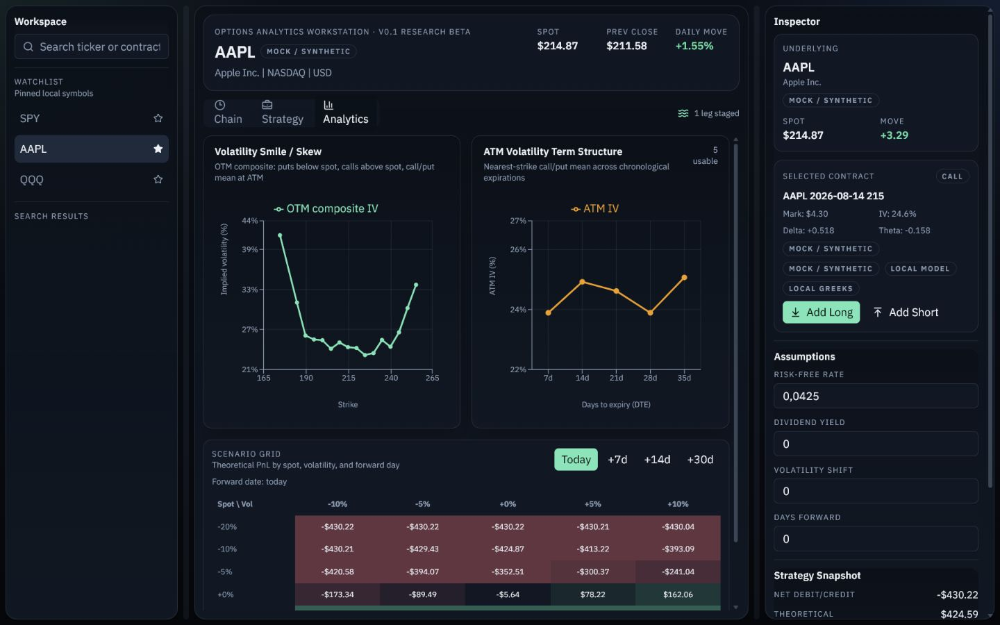
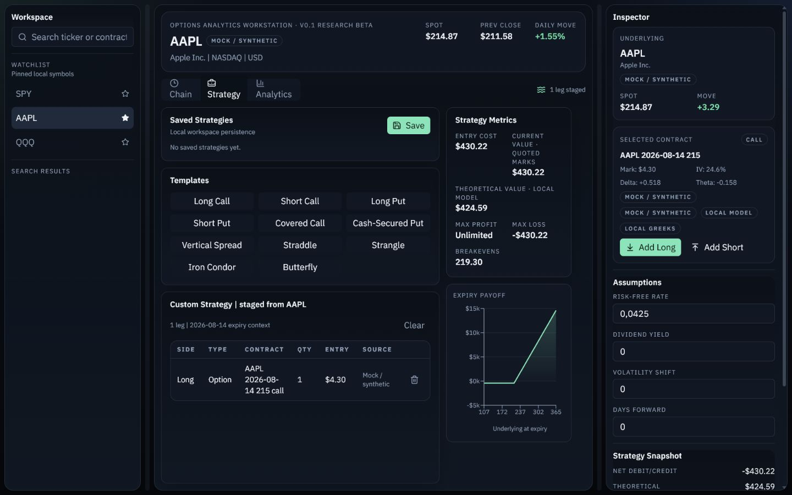
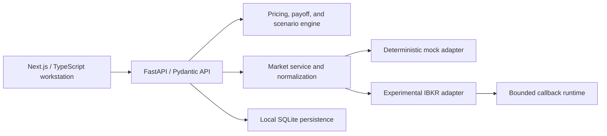

# Options Analytics Workstation

**v0.1 research beta · local-first · deterministic mock demo · no order execution**

Options Analytics Workstation is a local-first options research and scenario-analysis application. It combines a FastAPI/Pydantic backend with a Next.js/TypeScript interface, an exact expiry-payoff engine, European Black-Scholes analytics, deterministic synthetic option chains, local persistence, and an experimental Interactive Brokers market-data adapter.

Mock mode is the supported reproducible experience. It requires no broker account, paid data, credentials, API keys, or cloud service.





## What this release demonstrates

- Exact piecewise-linear expiry payoff analysis over non-negative spot, including analytical breakevens and correct bounded/unbounded profit and loss.
- European Black–Scholes prices and Greeks with continuous dividend yield, expiry/zero-volatility limits, negative-rate support, and bounded implied-volatility solving.
- Typed financial request validation and explicit finite, unlimited, unavailable, partial, stale, delayed/frozen, permission, mock, local-model, and broker-model states.
- Deterministic synthetic chains for SPY, AAPL, NVDA, TSLA, and QQQ with five expirations, realistic strike spacing, skew/term structure, liquidity fields, and stable edge-case fixtures.
- Symbol search, option-chain inspection, contract staging, standard strategy templates, payoff visualization, day-aware scenario analysis, and saved-strategy persistence.
- Broker-neutral service and normalization boundaries around an experimental IBKR adapter.
- Deterministic adapter fixtures for quote modes, missing fields/permissions, ambiguity, stale/crossed data, connection loss/recovery, cancellation, and shutdown.
- A clean installable backend wheel, reproducible frontend lockfile, repository-hygiene scanner, and independent backend/frontend CI definitions.

## Verification status

| Area | Status | Evidence |
|---|---|---|
| Mock research workflow | Verified | Backend integration tests, frontend unit/component tests, deterministic Playwright workflow at three desktop viewports, and manually inspected real captures |
| Exact payoff metrics | Verified | Reference-result and multi-leg piecewise tests independent of the chart interval |
| Black–Scholes / IV | Verified | Boundary, parity, dividend, negative-rate, premium-bound, convergence, and finite-difference Greek tests |
| Persistence | Verified | SQLite repository/API tests and save/list/load/delete browser workflow |
| Backend packaging | Verified | Clean source build, 41-module wheel inspection, clean virtual-environment install/import/API smoke |
| Frontend production build | Verified | Clean `npm ci`, tests, TypeScript, audit, and Next.js production build |
| Experimental IBKR adapter | Contract-tested with the modern client; subscribed market-data validation in progress | TWS Paper plus official `ibapi 10.45.1` delivered live EUR/USD callbacks; SPY was classified delayed but delivered no prices; US-equity/options subscribed-data validation remains pending |

## Quick start: deterministic mock mode

Prerequisites: Python 3.12+ and Node.js 20.9+ (Node 22 recommended). Use two terminals from the repository root.

### 1. Backend

```powershell
Set-Location backend
py -m venv .venv
.\.venv\Scripts\python.exe -m pip install -e ".[dev]"
$env:MODELLATOR_DATA_MODE="mock"
.\.venv\Scripts\python.exe -m uvicorn app.main:app --reload --port 8000
```

### 2. Frontend

```powershell
Set-Location frontend
npm ci
npm run dev
```

Open [http://localhost:3000](http://localhost:3000). Use `localhost`, not `127.0.0.1`, unless you also change the configured backend CORS origin.

The primary demo path is:

```text
symbol search → chain → contract inspection → strategy construction
→ exact payoff → spot/volatility/time scenarios → save → reload
```

Mock mode uses a fixed UTC valuation clock and seeded fixtures, so two runs with the same source produce the same market data. All synthetic values are visibly labelled `Mock / synthetic`.

The base/backend installation intentionally does not install `ibapi`. Mock mode, the quant engine, API, frontend, and normal automated tests require neither TWS nor an IBKR API installation.

## Architecture



The main boundaries are:

- `backend/app/quant`: model and exact payoff logic with no UI or broker dependency.
- `backend/app/models`: finite typed financial/API contracts and cross-field validation.
- `backend/app/services`: adapter-neutral orchestration, caching, normalization, provenance, and persistence repositories.
- `backend/app/services/adapters`: deterministic mock implementation and isolated IBKR runtime/contract translation.
- `frontend/lib` and `frontend/hooks`: typed transport, finite-safe formatting, strategy construction, persisted workstation state, and bounded stream reconnect.
- `frontend/components`: chain, strategy, analytics, persistence, and presentation states.

See [`docs/ARCHITECTURE.md`](docs/ARCHITECTURE.md) for request flows and trust boundaries.

## Quantitative assumptions

Local theoretical prices and Greeks use the European Black–Scholes model with continuous dividend yield. The implementation handles expiry and deterministic zero-volatility limits, permits financially valid negative interest rates, enforces theoretical premium bounds for implied volatility, and returns unavailable rather than an unconverged midpoint.

Many listed US equity and ETF options are American-style. Early exercise and discrete dividends are not fully represented by this local model. Local values can therefore differ materially from broker values or market prices, especially around dividends or exercise-sensitive situations.

Expiry payoff summaries are exact for the represented cash flows but exclude commissions, fees, taxes, margin, slippage, borrow, assignment, and exercise mechanics. The finite payoff grid exists only to render a chart; it is not the source of maximum profit, maximum loss, or breakevens.

For mixed-expiration scenario horizons, each live leg retains its own time to expiry. An already-expired option is settled to intrinsic value using the static scenario spot, and that cash is carried to the scenario date at the configured continuously compounded risk-free rate. This is an explicit static-shock convention, not a path-dependent historical simulation.

## Data provenance and quality

- `Mock / synthetic`: deterministic demo values generated locally.
- `Broker quote`: a field received from the adapter and retained with its data mode and timestamps.
- `Broker model`: IBKR model IV/Greeks when a complete prioritized model tick is present.
- `Local model`: a value solved or calculated locally from a usable non-crossed bid/ask mark.
- `LIVE`, `FROZEN`, `DELAYED`, and `DELAYED FROZEN`: distinct modes taken from IBKR's per-request `marketDataType` callback, not inferred from a local clock.
- `UNCONFIRMED`: a defensive unavailable state used when price callbacks arrive without the provenance callback; it is never guessed to be delayed or live.
- `Partial`, `Stale`, `Crossed`, `Missing subscription`, and `Unavailable`: explicit quality states; they are not converted to zero.

A lone last trade is never promoted to a trustworthy automatic option mark. Valid delayed, frozen, or delayed-frozen pairs may produce an explicitly flagged research reference midpoint, but they are not represented as current executable market data. Missing broker Greeks can trigger an explicitly labelled local calculation when inputs are valid.

## Experimental IBKR boundary

IBKR support is disabled by default. It is designed only for read-only contract and market-data research. The repository contains no order submission/routing and no account, portfolio, position, margin, or execution access.

IBKR mode requires the official TWS API Python client to be installed separately from an official TWS API distribution. Modellator no longer depends on or installs the obsolete PyPI package `ibapi==9.81.1.post1`. The minimum supported interface is official `ibapi 10.45.1`; later versions are accepted only when the required modern callback contract is present. From `backend`, install from the conventional Windows source location with:

```powershell
.\scripts\install_official_ibkr_api.ps1 `
  -SourcePath "C:\TWS API\source\pythonclient" `
  -PythonPath ".\.venv\Scripts\python.exe"
```

The helper validates the source layout, builds from a disposable copy so the official source tree is not modified, installs through the selected Python interpreter, prints the installed version, and checks the modern callback interface. `MODELLATOR_IBKR_API_SOURCE` can supply a different official source location. It never downloads `ibapi` from PyPI. If IBKR mode is explicitly selected without a compatible client, startup fails with installation guidance; it never falls back to mock mode.

With `MODELLATOR_IBKR_USE_DELAYED=true`, the adapter requests IBKR market-data type `4` (delayed-frozen-capable). TWS may then return live, delayed, or delayed-frozen data; the adapter records the actual callback type `1`, `2`, `3`, or `4` for each request. With delayed mode disabled, the existing live-only behavior remains unchanged.

The adapter has deterministic coverage for requested type `4`, all four callback modes, transitions between delayed and delayed-frozen, permission failures, unavailable `-1` prices, absent sides/last, partial IV/Greeks, crossed/stale markets, ambiguous/invalid contracts, competing computation ticks, connection failure/loss/recovery, cancellation, and shutdown. A type-`3` callback with no prices is reported as `no_price_callbacks` with delayed provenance; no entitlement error is invented. This does **not** prove real subscriptions, callback ordering, or complete TWS behavior.

Manual validation so far includes a successful TWS Paper connection with official `ibapi 10.45.1` and live EUR/USD market-data callbacks. A SPY request reached TWS in delayed mode but returned no prices, so subscribed US-equity and options validation remains pending.

The subscribed-data procedure is documented in [`docs/IBKR_MANUAL_VALIDATION.md`](docs/IBKR_MANUAL_VALIDATION.md). The opt-in helper refuses to run without an explicit acknowledgement and reports sanitized handshake, requested-mode, callback, unavailable-price, error, provenance, and timeout-stage diagnostics:

```powershell
Set-Location backend
$env:MODELLATOR_IBKR_READONLY_SMOKE="I_UNDERSTAND_READ_ONLY"
$env:MODELLATOR_IBKR_SMOKE_INSTRUMENT="SPY"
$env:MODELLATOR_IBKR_SMOKE_SYMBOL="SPY"
.\.venv\Scripts\python.exe scripts\ibkr_readonly_smoke.py
```

For the known-good compatibility path, set `MODELLATOR_IBKR_SMOKE_INSTRUMENT="EURUSD"`. The helper remains limited to market data and security definitions and reports the client package version, TWS server version when available, requested and actual data modes, request errors, farm-status messages, bid/ask/last callback availability, elapsed time, usability, reason code, and provenance.

Do not run that helper as part of the normal mock demo or CI.

## Validation commands

### Backend

```powershell
Set-Location backend
.\.venv\Scripts\python.exe -m ruff check --no-cache .
.\.venv\Scripts\python.exe -m ruff format --check --no-cache .
$env:PYTHONPATH='.'; .\.venv\Scripts\python.exe -m pytest -q
.\.venv\Scripts\python.exe -m build
.\.venv\Scripts\python.exe scripts\verify_wheel.py <wheel-path>
```

### Frontend

```powershell
Set-Location frontend
npm ci
npm audit
npm test
npm run typecheck
npm run build
npx playwright install chromium
npm run test:visual
```

### Repository hygiene

```powershell
python scripts\check_repository_hygiene.py --tracked
```

Real-IBKR tests skip by default and CI forces deterministic mock mode with no secrets.

## Local persistence and configuration

Watchlists, recent chains, settings, and saved strategies use local SQLite. `backend/data/modellator.db` is user data and is ignored by Git. The browser retains existing `MODELLATOR_*` localStorage keys for compatibility.

The root [`.env.example`](.env.example) is a non-secret configuration reference; the application does not silently load it. The documented quick start explicitly forces mock mode. Existing internal `MODELLATOR_*` environment names are preserved.

## Project documents

- [`KNOWN_LIMITATIONS.md`](KNOWN_LIMITATIONS.md) — model, data, adapter, UI, and safety boundaries.
- [`ROADMAP.md`](ROADMAP.md) — truthful completed/pending checklist and explicit non-goals.
- [`docs/ARCHITECTURE.md`](docs/ARCHITECTURE.md) — modules, flows, and trust boundaries.
- [`docs/IBKR_MANUAL_VALIDATION.md`](docs/IBKR_MANUAL_VALIDATION.md) — later subscribed-data test matrix and evidence rules.

## License and disclaimer

Released under the [MIT License](LICENSE).

This software is for educational and research purposes only. It is not investment advice, a recommendation, production trading software, a market-data warranty, or an execution system. Models and synthetic data can be wrong or incomplete. Independently verify all data, assumptions, and results before making financial decisions.
