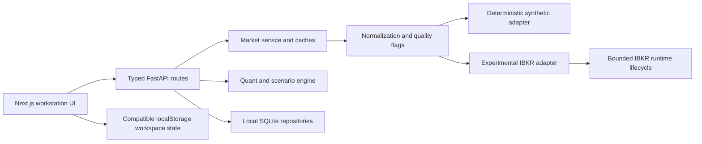
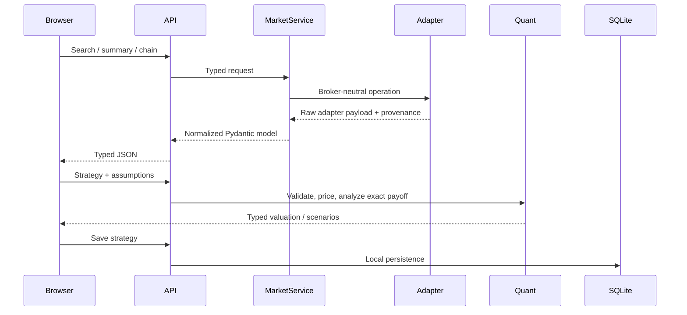

# Architecture

Options Analytics Workstation is a local-first two-process application. The design keeps market adapters, normalized domain data, quantitative logic, persistence, transport, client state, and presentation separate so each boundary can be tested without a broker session.

## Backend boundaries

### API and typed models

`backend/app/api` exposes health, underlying, chain, option, volatility, strategy/scenario, watchlist, and workspace endpoints. `backend/app/models` is the validation boundary: finite values, positive prices/strikes/quantities/multipliers, valid scenario moves, and cross-leg symbol integrity are enforced before service or quant execution.

FastAPI maps genuine unknown instruments to 404, ambiguous contracts to 409, invalid requests to 422, and adapter unavailability to 503. The application lifespan closes the market adapter.

### Quantitative engine

`backend/app/quant/black_scholes.py` implements European Black–Scholes prices and Greeks with continuous dividend yield, expiry limits, and deterministic zero-volatility limits. `implied_volatility.py` applies theoretical price bounds and returns unavailable on invalid inputs or nonconvergence.

`payoff.py` computes exact expiry risk over `S >= 0` from piecewise-linear segments. It includes zero, all strikes, analytical roots, and the upper-tail slope. `strategy.py` uses that exact result for summaries and a separate finite sampling grid for charts.

### Market data

`MockIBKRAdapter` is the supported demo adapter. Its clock, symbol set, expirations, strikes, and pseudo-random seeds are deterministic. Every normalized result remains labelled mock/synthetic.

`IBKRAdapter` is experimental. `IBKRRuntime` owns connection state, bounded reconnect, request registries, callback collection, cancellation, and cleanup. Raw broker payloads are not returned directly to the UI. The normalization layer preserves market-data mode, contract identity, exchange/receipt timestamps, missing fields, broker model values, local model values, and quality flags.

### Persistence

SQLite repositories persist watchlist items, user pricing settings, recently viewed chains, and saved strategies. Connections are short-lived and local. `backend/data/modellator.db` is user data excluded from Git.

## Frontend boundaries

- `frontend/lib/types.ts`: API/domain contracts.
- `frontend/lib/api.ts`: transport, structured error classification, and request deduplication.
- `frontend/hooks`: persisted workstation state, market streams, and bounded reconnect behavior.
- `frontend/lib/strategy-templates.ts`: standard strategy construction with ordered usable strikes.
- `frontend/components/chain`: chain display, filters, and contract selection.
- `frontend/components/strategy`: leg management, exact summaries, payoff rendering, and saved strategies.
- `frontend/components/analytics`: volatility views and day-aware scenario grids.

Non-finite values are filtered or formatted as unavailable. Presentation retains mock, broker quote, broker model, local model, delayed/frozen, stale, partial, and permission state rather than substituting zero.

## Principal request flows

## Trust boundaries

- Mock values are test/demo data, never broker data.
- Broker-reported values and locally derived values occupy distinct fields and source states.
- IBKR account and trading surfaces are outside the design boundary.
- Numerical chart samples are presentation data, never authoritative exact risk summaries.
- Repository hygiene and CI reject local data, environment files, caches, package metadata, and common credential signatures.
